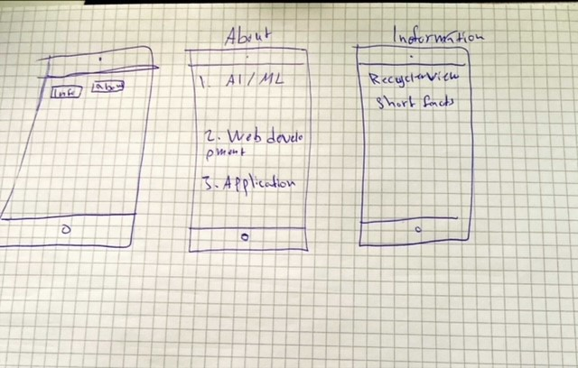
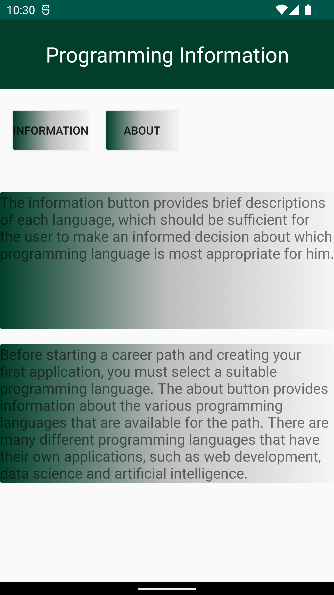
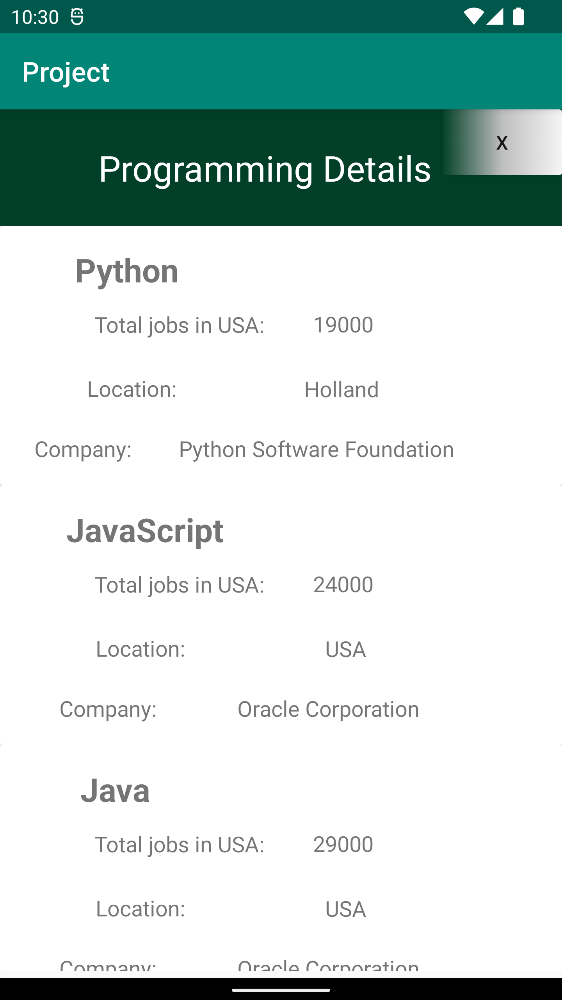
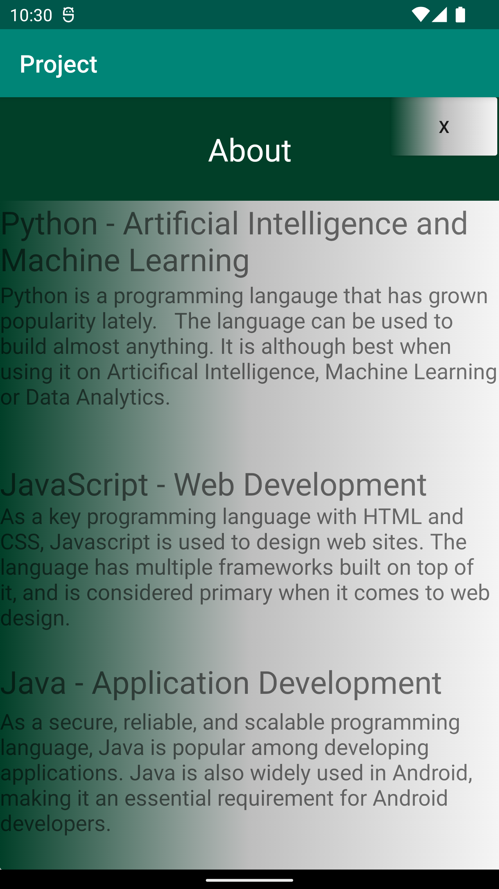

There was a plan to create a frontpage consisting of two buttons. Each button was intended to direct you to a specific page containing specific information. Therefore, the main activity consists primarily of locating the button IDs. Our next step is to set the onclicklistener to the button that will execute the code you write in onClick(View) when the user presses the button.The class involves two distinct methods that refer intents to their correct page.



Example of onclicklistener and intents
```
 about_btn.setOnClickListener(new View.OnClickListener() {
            @Override
            public void onClick(View view) {
                onClickAbout();
            }
        });
```

```
private void onClickAbout() {
        Intent aboutIntent = new Intent(MainActivity.this, About.class);
        startActivity(aboutIntent);
    }
```


Next, it was necessary to implement JSON data by putting the data into the admin interface of the Lenasys site. It is necessary to have admin permission to request JSON data from a URL. This permission must be granted in *AndroidManifest.xml**. Afterwards, a new class is created to choose which data will be taken from the JSON data. A new class will consist of a constructor and setters/getters containing the data that will be shown from JSON. In this project this class is called **ProgrammingLanguages.java**. In this case the strings name, company and location also integer size was included in **ProgrammingLanguages**

After the data has been sorted for each data type, we need to set up an adapter object. The adapter is responsible for sorting the view based on each data type. This class is contains an arraylist of *ProgrammingLanguages**. This class contains built-in methods that are provided by the IDE when extending the class.``public class ProgrammingAdapter extends RecyclerView.Adapter<ProgrammingAdapter.MyViewHolder>``

The **onCreateViewHolder** creates a new RecyclerView Viewholder. The method consists of LayoutInflater which instantiates a layout with its corresponding view objects.It has to consist of which xml file it will attach its view objects to.

```
	    public MyViewHolder onCreateViewHolder(@NonNull ViewGroup parent, int viewType) {
        View view = LayoutInflater.from(parent.getContext()).inflate(R.layout.recyclerview_row, parent, false);
        return new ProgrammingAdapter.MyViewHolder(view);
    }
```

There after there will be an inner class which consist of Super** and the different data sets that are redirected to the correct xml IDs.

```
    public static class MyViewHolder extends RecyclerView.ViewHolder{
        TextView name;
        TextView company;
        TextView location;
        TextView size;


        public MyViewHolder(@NonNull View itemView) {
            super(itemView);
            name = itemView.findViewById(R.id.name_txt);
            location = itemView.findViewById(R.id.location_txt);
            company = itemView.findViewById(R.id.company_txt);
            size = itemView.findViewById(R.id.size_txt);
        }
    }
```

OnBindViewHolder is to display the data at the corrected position. This method also updates the contents of the Recyclerler viewholder for each item and its respective position. The problem that occured was with converting integers to strings. In this case a + “” had to be added. To get the data the different getters are used from ProgrammingLanguages class

```
    public void onBindViewHolder(@NonNull MyViewHolder holder, int position) {
        holder.name.setText(mProgrammingData.get(position).getName());
        holder.location.setText(mProgrammingData.get(position).getLocation());
        holder.company.setText(mProgrammingData.get(position).getCompany());
        holder.size.setText(mProgrammingData.get(position).getSize()+"");
    }
```

The getItemCount method returns the total numbers of items in the data set which is inside of ArrayList ProgrammingLangauges. In ProgrammingAdapter when called the object, it got named *mProgrammingData**

The SecondActivity consists of many different data variables. All of them are private which means the member data is only visible within the class, not from any other classes. The JSON url consists also a final which means the url that is set can’t be changed. Recyclerview has to be connected to the recyclerview inside of the xml file. Afterwards we set the recyclerview to linearlayout and get our data from ArrayList from ProgrammingAdapter. The recyclerview has also to be set to ProgrammingAdapter.The GSON is used to unload the data from JSON.

The data will be fetched with the help of a class given from the examinator, called JsonTask. That class consists of Asynchronous task which in short it will create a seperate thread to run in background in order to parse JSON data. In SecondActivity we will create a method called onPostExecute which will fetch JSON data and put it in a temporary ArrayList and clear current ArrayList from Adapter and add the newly fetched one.

```
    @Override
    public void onPostExecute(String json) {
        Log.d("SecondActivity", json);
        // Creating a new temporary list, We will fetch the json data and put it in there before updating the mountain list.
        ArrayList<ProgrammingLanguages> temp = new ArrayList <ProgrammingLanguages>();
        temp = gson.fromJson(json, type);
        // Clearing the current arraylist before adding the newly fetched one.
        mProgrammingData.clear();
        mProgrammingData.addAll(temp);
        programmingAdapter.notifyDataSetChanged();

    }
```

The information about how many jobs there were in USA was taken from ``https://www.northeastern.edu/graduate/blog/most-popular-programming-languages/``.




